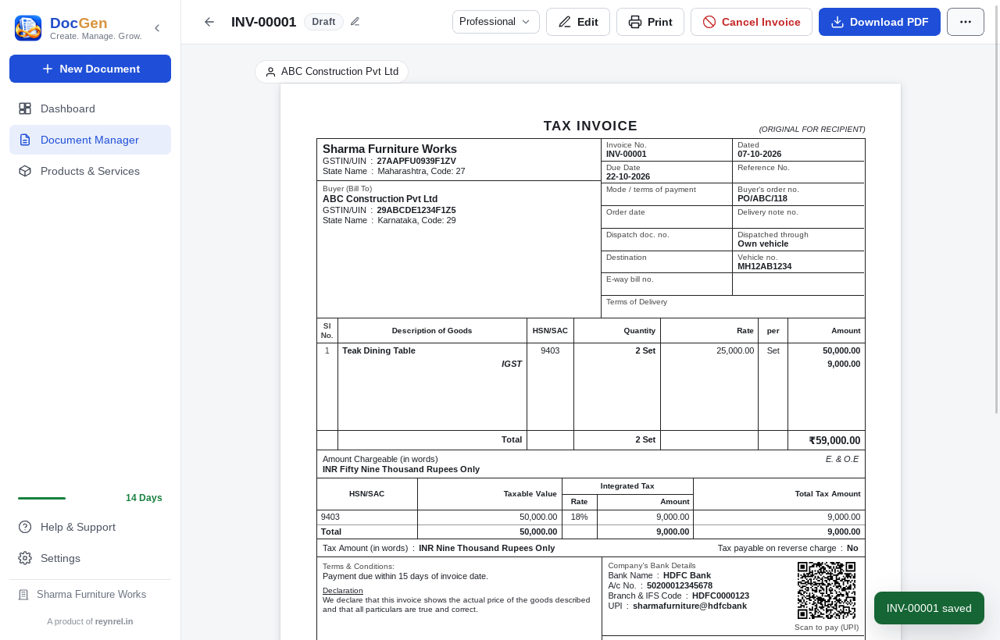

# DocGen

**Create. Manage. Grow.** — a lightweight, offline-first business document generator for
small businesses, by [reynrel.in](https://reynrel.in).

| Part | Folder | Stack |
|------|--------|-------|
| Desktop app (Windows, macOS, Linux) | [`document-generator/`](document-generator/) | Tauri 2, React (JavaScript), SQLite |
| Server: license & configuration API + website, client panel + admin panel (one port) | [`server/`](server/): [`backend/`](server/backend/) + [`frontend/`](server/frontend/) | Node.js, Express 5, MySQL 8 (SQLite for development); React + Vite |
| DocGen Mobile (Android, iPhone — installable web app, served by the server at `/app/`) | [`server/mobile/`](server/mobile/) | React + Vite PWA, IndexedDB |

- **Desktop**: GST invoices (Tally-style and other templates), quotations, orders, challans,
  notes, receipts, work orders; Dashboard with document counts; Document Manager with uploaded
  files; 30 days to try, then account login or license; works fully offline.
- **Server**: customer accounts, products with a price per duration (1, 2, 5 years …), Razorpay payments
  verified on the server, license keys with start and expiry date, computer and phone limits enforced
  by the server, remote app configuration and ads, admin API, audit log.
- **Website**: product page with one pricing card per plan, Help & Support (send a request), Contact Us,
  Terms & Conditions, Privacy Policy, Shipping Policy, Cancellation & Refunds; checkout asks the buyer to
  accept the Terms & Conditions.
- **Client panel**: My License (key, validity, devices), Services (buy or extend — shows the new expiry),
  Downloads (Windows, macOS, Linux, Mobile), Help & Support (requests and answers), Account. **Admin panel**:
  customers, support requests, payments, licenses, products & pricing, downloads, website (incl. business
  details for the policies), app settings, ads, activity log. Both work on phones.
- **DocGen Mobile**: install from the client panel (Downloads → Mobile), enter the license key once and use the
  desktop app's features on the phone — all document types, the same 4 templates, documents, products and
  settings (it shares the desktop app's code); data stays on the phone.



## Getting started

```bash
# 1. Server + portal + admin panel, all on http://localhost:8787 (admin at /admin/login).
#    Creates data/ and prints the license public key.
cd server && npm install
ADMIN_EMAIL=admin@example.com ADMIN_PASSWORD='change-me-now' npm start   # or npm run dev (live reload)

# 2. Desktop app
cd document-generator && npm install
DOCGEN_SERVER_URL=http://localhost:8787 DOCGEN_PORTAL_URL=http://localhost:8787 \
DOCGEN_LICENSE_PUBLIC_KEY=<key from step 1> npm run app:dev
```

Without a server the desktop app runs as a fully offline build (30 days + built-in messages only).

Windows (`.exe`, `.msi`) and macOS (`.dmg`, Apple Silicon + Intel) installers are built by GitHub Actions
(`.github/workflows/docgen-build.yml`) and published on the *DocGen latest build* release — no local
Visual Studio or Xcode needed.

## Documentation

- [Desktop app](document-generator/README.md): features, configuration, data, document types, build
- [Server](server/README.md): configuration, deployment, licensing, payments, ads, API, security
- [Portal & admin panel](server/frontend/README.md)
- [DocGen Mobile](server/README.md#docgen-mobile)
- [Test results](TESTING.md): unit, API, end-to-end and performance
