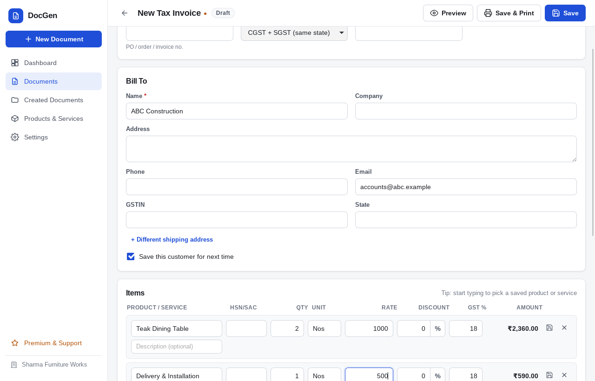
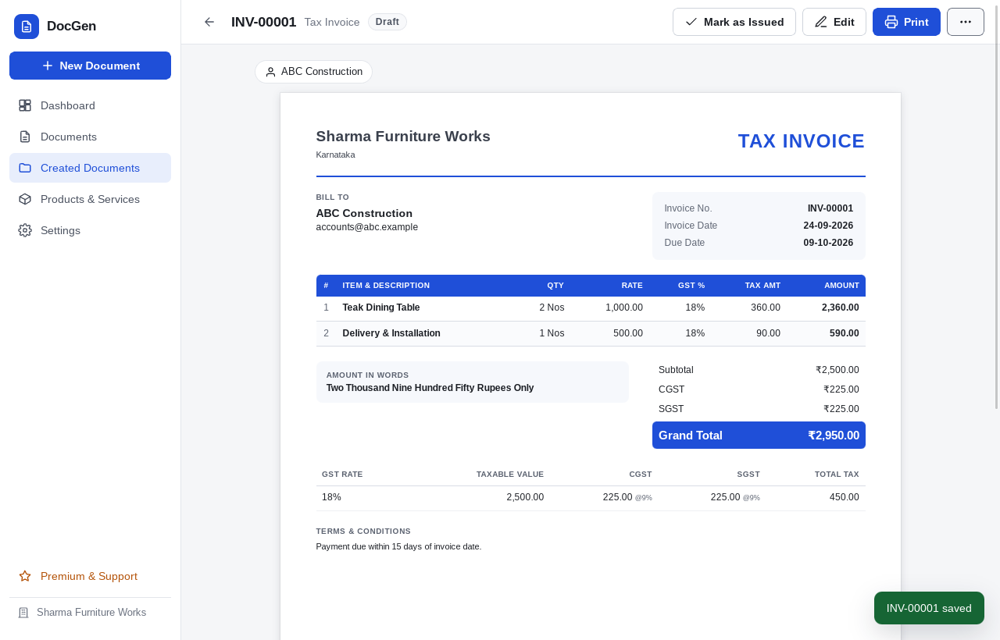
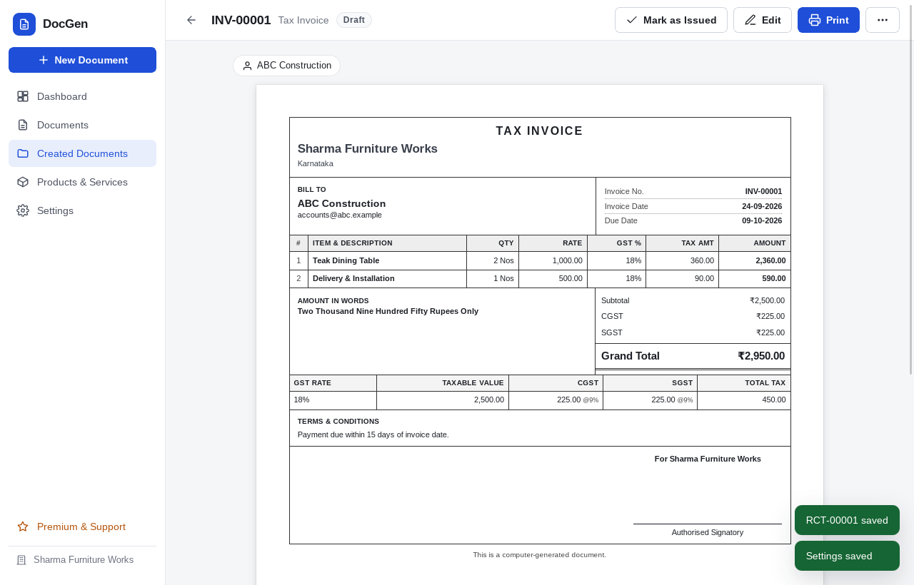
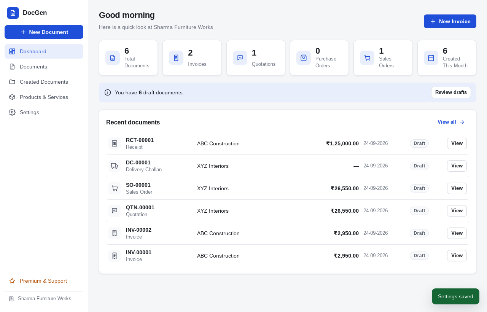
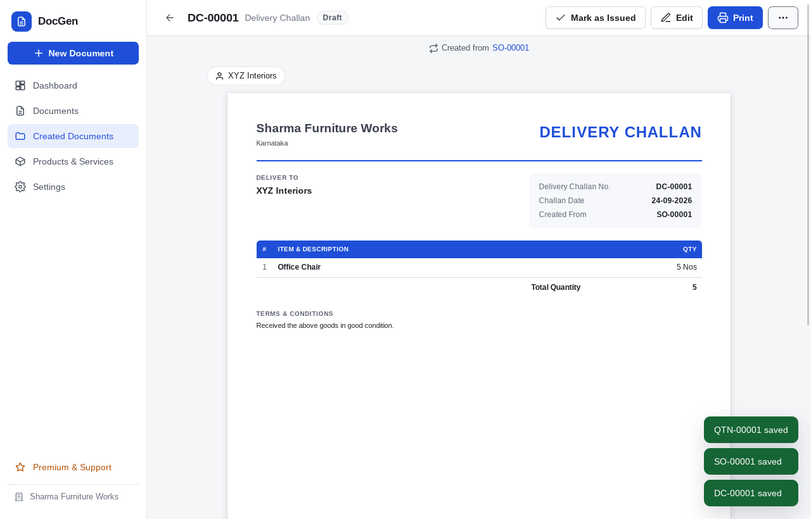
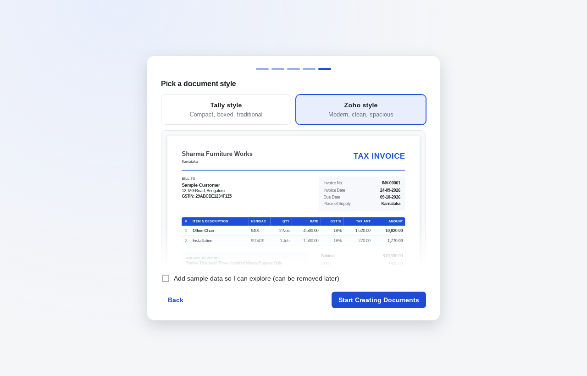

# DocGen — lightweight offline document generator

DocGen is a small, fast desktop app for creating professional business documents
(invoices, quotations, orders, challans, credit/debit notes and receipts). It is
built with **Tauri 2 + React (JavaScript) + SQLite**, works completely
**offline**, and keeps all business data in one local file.

It is deliberately *not* an ERP: install it, type your company name, and create
your first GST invoice in about two minutes.

| Invoice editor | Zoho-style invoice | Tally-style invoice |
|---|---|---|
|  |  |  |

| Dashboard | Delivery challan (no prices) | First-launch style picker |
|---|---|---|
|  |  |  |

---

## Features

- **10 document types**: Quotation / Estimate, Proforma Invoice, Sales Order, Purchase Order,
  Tax Invoice, Delivery Challan, Goods Receipt Note, Credit Note, Debit Note, Payment Receipt
- **Indian GST** (CGST + SGST / IGST chosen automatically from the place of supply), VAT or no tax,
  custom rates, GST breakup table
- **Exact money maths**: fixed-point decimal engine (no floating-point errors), round-off
- **Amount in words** (Indian Lakh/Crore and international Million/Billion, Rupees & Paise …)
- **Automatic numbering**: `INV-00001`, `INV/2026-27/0001`, yearly reset, allocated inside SQLite transactions
- **Two print styles**: *Tally* (compact, boxed) and *Zoho* (modern) — A4, multi-page, repeating table headers
- **Print & PDF** through the native print dialog (Save as PDF / Microsoft Print to PDF)
- **Conversion with lineage**: Quotation → Sales Order / Proforma / Invoice, Sales Order → Invoice / Challan,
  Purchase Order → Goods Receipt, Invoice → Challan / Credit / Debit Note / Receipt ("Created from QTN-00024")
- **Created Documents**: search by number, customer, product or type; filter by type, date and status;
  view, edit, print, duplicate, delete (soft delete with restore); void issued invoices
- **Products & Services** with categories, HSN/SAC, tax-inclusive/exclusive prices
- **Saved customers** (optional), contact panel with Call / Email / WhatsApp
- **Settings**: company, logo, signature, stamp, bank & UPI, per-document-type options and terms,
  tax, currencies with manual exchange rates, numbering, theme (light/dark/system)
- **Backup / restore** of the whole database with an automatic safety copy
- **Optional QR code** (UPI payment, document reference, contact or custom text)
- **First-launch wizard** (5 short steps) and removable sample data
- **Optional remote-configured ads**, sandboxed, rate-limited, never sending business data
- Keyboard shortcuts: `Ctrl/Cmd+N` new, `Ctrl/Cmd+S` save, `Ctrl/Cmd+P` print, `Ctrl/Cmd+F` search, `Esc` close

---

## Project structure

```
document-generator/
├── index.html                 Vite entry
├── package.json               npm scripts & dependencies
├── vite.config.js             Vite config (port 1420, Tauri targets)
├── eslint.config.js
├── src/                       React UI (JavaScript + JSDoc)
│   ├── main.jsx, App.jsx      bootstrap, providers, route table
│   ├── router/router.jsx      tiny hash router with unsaved-changes guard
│   ├── layouts/AppLayout.jsx  sidebar + main area, New Document chooser
│   ├── components/            Icon, Modal, Form controls, Autocomplete, badges, menus
│   ├── config/
│   │   ├── documentTypes.js   ◀ document type registry (add new types here)
│   │   ├── defaults.js        default settings, currencies, states, per-type setting resolution
│   │   └── appConfig.js       publisher/support details for the Premium page
│   ├── features/
│   │   ├── dashboard/         summary cards + recent documents
│   │   ├── documents/         Documents home, Created Documents, editor, viewer, actions
│   │   ├── products/          Products & Services, categories
│   │   ├── settings/          all settings sections, backup, about
│   │   ├── setup/             first-launch wizard
│   │   ├── premium/           Premium & Support page
│   │   └── ads/               ad scheduling (adService.js) and sandboxed popup
│   ├── renderer/              HTML document renderer (reusable blocks, Tally/Zoho CSS, A4 preview)
│   ├── services/              calls to Tauri commands (documents, catalog, settings, backup, demo)
│   ├── hooks/                 app data context, toasts/confirm dialogs, shortcuts
│   ├── utils/                 decimal.js, calc.js, numberToWords.js, format.js, dates.js, qr.js
│   └── styles/                app.css (UI + themes), print.css (A4 print rules)
├── src-tauri/                 Rust backend
│   ├── Cargo.toml, build.rs, tauri.conf.json
│   ├── capabilities/default.json   minimal permissions (core:default only)
│   ├── remote-config.json     ad server URLs (empty = no network at all)
│   ├── migrations/            001_initial.sql, 002_add_document_settings.sql, 003_add_ad_state.sql
│   ├── icons/                 generated app icons
│   └── src/
│       ├── main.rs, lib.rs    app entry, plugin & command registration
│       ├── db.rs              SQLite connection, migrations, friendly errors, JSON helpers
│       ├── commands.rs        all Tauri commands + integration tests
│       ├── numbering.rs       transactional document numbering
│       └── remote.rs          remote config download & strict validation
├── tests/utils.test.js        unit tests (decimal, GST, words, formatting)
├── e2e/run.mjs                end-to-end test of the real desktop binary (tauri-driver)
├── ad-server/                 minimal Express ad/config server + sample ad
└── docs/AD_SERVER.md          how to host the ad configuration
```

---

## Prerequisites

| Tool | Version |
|------|---------|
| Node.js | 18+ (20/22 recommended) |
| Rust | stable 1.77+ (`rustup`) |
| Tauri system dependencies | see <https://v2.tauri.app/start/prerequisites/> |

- **Windows**: Microsoft C++ Build Tools ("Desktop development with C++") and WebView2 (preinstalled on Windows 10/11).
- **macOS**: Xcode Command Line Tools (`xcode-select --install`).
- **Linux (Debian/Ubuntu)**:
  `sudo apt install libwebkit2gtk-4.1-dev build-essential curl wget file libxdo-dev libssl-dev libayatana-appindicator3-dev librsvg2-dev`

## Installation & development

```bash
cd document-generator
npm install
npm run app:dev        # starts Vite on :1420 and opens the desktop window (hot reload)
```

The UI only works inside the Tauri window (it talks to the Rust backend); opening
`http://localhost:1420` in a normal browser shows a friendly error.

### Troubleshooting on Windows

**`linker 'link.exe' not found`**: Rust on Windows needs Microsoft's C++ linker.
VS Code is not enough. Install the Build Tools with the C++ workload (about 2–6 GB, one time):

```powershell
winget install Microsoft.VisualStudio.2022.BuildTools --override "--wait --passive --add Microsoft.VisualStudio.Workload.VCTools --includeRecommended"
```

Or download it from <https://visualstudio.microsoft.com/visual-cpp-build-tools/> and tick
**"Desktop development with C++"**. Keep the *MSVC v143* and *Windows 11 SDK* items selected.
Then **close and reopen the terminal** and check:

```powershell
rustup default stable-msvc
rustup show              # should list x86_64-pc-windows-msvc
```

**`Port 1420 is already in use`**: a previous `npm run app:dev` is still running in the
background. Stop it and start again:

```powershell
Get-NetTCPConnection -LocalPort 1420 -State Listen | ForEach-Object { Stop-Process -Id $_.OwningProcess -Force }
npm run app:dev
```

(Command Prompt: `netstat -ano | findstr :1420`, then `taskkill /PID <number> /F`.)

The first `app:dev` or `app:build` compiles all Rust dependencies and takes 3–10 minutes.
Later runs take a few seconds.

## SQLite setup

Nothing to install — SQLite is compiled into the app (`rusqlite` with the `bundled` feature).
On first start DocGen creates the database and runs all migrations automatically:

| OS | Data file |
|----|-----------|
| Windows | `%APPDATA%\com.docgen.desktop\docgen.sqlite` |
| macOS | `~/Library/Application Support/com.docgen.desktop/docgen.sqlite` |
| Linux | `~/.local/share/com.docgen.desktop/docgen.sqlite` |

The same folder contains `docgen.log` (technical error log) and `backups/` (automatic
safety copies made before a restore). Settings → About shows the exact path.

**Migrations** live in `src-tauri/migrations/` and are listed in `src-tauri/src/db.rs`
(`MIGRATIONS`). Each runs once inside a transaction and is recorded in `schema_migrations`.
To change the schema, add `004_something.sql` and append it to the list — never edit an
applied migration.

Money and quantities are stored as exact decimal text (e.g. `"1180.00"`) and every
document keeps a snapshot of the customer details, item lines, tax breakup and totals
exactly as printed.

## Build

```bash
npm run build          # frontend only (dist/)
npm run app:build      # optimized desktop build + installers for the current OS
```

Output: `src-tauri/target/release/bundle/…`

### Windows installer

Run on Windows (Tauri cannot cross-compile Windows installers from Linux/macOS reliably):

```powershell
cd document-generator
npm install
npm run app:build
```

This produces:

- `src-tauri\target\release\bundle\nsis\DocGen_1.0.0_x64-setup.exe` (recommended; per-user install, no admin needed)
- `src-tauri\target\release\bundle\msi\DocGen_1.0.0_x64_en-US.msi`

Only NSIS: `npx tauri build --bundles nsis`. The installer downloads the WebView2
runtime automatically on the rare systems that lack it. For a trusted installer,
sign it with your code-signing certificate
(<https://v2.tauri.app/distribute/sign/windows/>).

You can also build Windows installers in CI with
[`tauri-apps/tauri-action`](https://github.com/tauri-apps/tauri-action) on a
`windows-latest` runner (set `projectPath: document-generator`).

### macOS / Linux

`npm run app:build` produces `.dmg`/`.app` on macOS and `.deb`/`.rpm`/`.AppImage` on Linux
(e.g. `npx tauri build --bundles deb`).

## Tests

```bash
npm test               # JS unit tests: decimal maths, GST split, round-off, words, formatting
npm run test:rust      # Rust tests: migrations, numbering, yearly reset, backup/restore, config validation
npm run lint

# End-to-end test of the real app (Linux; needs tauri-driver + WebKitWebDriver + Xvfb)
cargo install tauri-driver --locked
sudo apt install webkit2gtk-driver xvfb
npx tauri build --debug --no-bundle
xvfb-run -a node e2e/run.mjs
```

The e2e test walks through the full first-use flow (setup wizard → invoice with GST →
save → preview → close & reopen → search → duplicate → convert → challan → delete/restore →
products → receipt → Tally style → ads) and saves screenshots to `e2e/screenshots/`.

## Printing & PDF

Every document has **Print** (Ctrl/Cmd+P). The native print dialog opens with an A4 page
(`@page { size: A4; margin: 12mm }`); the sidebar, buttons and toolbars are never printed,
table headers repeat on each page and rows are never split.

**Export PDF** uses the same dialog: choose *Save as PDF* (macOS/Linux) or
*Microsoft Print to PDF* (Windows). The PDF is therefore identical to the printed
page and no PDF library is bundled (keeps the installer small). The suggested file name
is the document number and customer.

## Backup & restore

Settings → Backup:

- **Export Backup** writes a consistent copy of the whole database (`VACUUM INTO`) to a
  `.docgen` file of your choice. It includes documents, products, customers, settings,
  logo, signature and stamp.
- **Import Backup** validates the file (SQLite integrity check, DocGen tables, schema
  version), saves a safety copy of your current data to `backups/before-restore-*.docgen`,
  then replaces the database and runs any newer migrations.

A `.docgen` file is a normal SQLite database — you can open it with any SQLite tool.

## Advertisement server & remote configuration

Optional. Set the URLs in `src-tauri/remote-config.json` before building:

```json
{ "configUrl": "https://myserver.com/api/app-config", "eventsUrl": "https://myserver.com/api/events", "requestTimeoutSecs": 8 }
```

Remote configuration format:

```json
{
  "version": 1,
  "fetchIntervalDays": 7,
  "ads": {
    "enabled": true,
    "monthlyLimit": 4,
    "minimumDaysBetweenAds": 7,
    "contentUrl": "https://myserver.com/ads/ad-01.html",
    "clickUrl": "https://myserver.com/product",
    "startAt": "2026-01-01T00:00:00Z",
    "endAt": "2026-12-31T23:59:59Z"
  }
}
```

A sample server is in `ad-server/` (`npm install && npm start`). Full details — hosting,
validation, caching, limits, tracking and security — are in
**[docs/AD_SERVER.md](docs/AD_SERVER.md)**.

With `configUrl` empty (the default) DocGen makes **no network requests at all**.

## Adding new document types

1. Add an entry to `DOCUMENT_TYPES` in `src/config/documentTypes.js`:

   ```js
   {
     id: 'WORK_ORDER',            // stored in SQLite (UPPER_SNAKE_CASE)
     label: 'Work Order',
     short: 'Work Order',
     prefix: 'WO',                // default numbering prefix
     title: 'WORK ORDER',         // printed title
     partyLabel: 'Customer',
     partyKind: 'customer',
     dateLabel: 'Order Date',
     dueLabel: 'Complete By',     // omit to hide the second date
     dueSetting: 'deliveryDays',
     layout: 'standard',          // or 'receipt'
     financial: false,            // true = issued copies must be voided, not deleted
     icon: 'documents',           // any name from components/Icon.jsx
     conversions: ['TAX_INVOICE'],
     defaults: { showBank: false, terms: 'Work as per agreed scope.' },
   }
   ```

2. That's it. The numbering sequence is created automatically on first save, and the
   type appears in the New Document chooser, Documents page, filters, Settings →
   Document Types and Settings → Numbering. To allow converting *into* it from another
   type, add its id to that type's `conversions`.

Rendering is shared: `src/renderer/DocumentRenderer.jsx` builds every document from
reusable blocks (`DocumentHeader`, `CompanyBlock`, `PartyBlock`, `DocumentMeta`,
`ItemsTable`, `TaxSummary`, `TotalsSummary`, `BankDetails`, `AmountInWords`,
`TermsAndConditions`, `SignatureBlock`, `DocumentFooter`). What is shown is controlled
by the per-type settings (`showPrices`, `showTax`, `showPackage`, …).

## Security notes

- The web layer has only `core:default` permissions — no filesystem, shell or HTTP
  plugins. File dialogs, backup, printing and link opening are done by DocGen's own
  Rust commands with fixed behaviour.
- All SQL is parameterised; dynamic column names come only from static allow-lists.
- Users see friendly messages; raw SQLite errors are written to `docgen.log`.
- CSP: `script-src 'self'`, no remote scripts, frames limited to HTTPS (ads only).
- Remote config is validated in Rust (HTTPS URLs, ranges, dates, size); ads run in a
  script-less sandboxed iframe; links opened externally must be `https:`, `mailto:` or `tel:`.
- Remote content is never injected into the app DOM and nothing from the server is executed.

## Updates (future)

The app is ready for the official Tauri updater. To enable it:

1. `npm run tauri add updater` (adds `tauri-plugin-updater` and its permission).
2. Generate a key pair: `npx tauri signer generate -w ~/.tauri/docgen.key`.
3. In `tauri.conf.json` set `"bundle": { "createUpdaterArtifacts": true }` and
   `"plugins": { "updater": { "pubkey": "<public key>", "endpoints": ["https://myserver.com/updates/{{target}}/{{arch}}/{{current_version}}"] } }`.
4. Call `check()` from `@tauri-apps/plugin-updater` (e.g. in Settings → About).

See <https://v2.tauri.app/plugin/updater/>. The ad configuration can never trigger an update.

## Customising

- Publisher/support details for the Premium page: `src/config/appConfig.js`
- App name, identifier and window size: `src-tauri/tauri.conf.json`
- Icons: replace `assets/app-icon.svg` and run `npx tauri icon assets/app-icon.svg -o src-tauri/icons`
