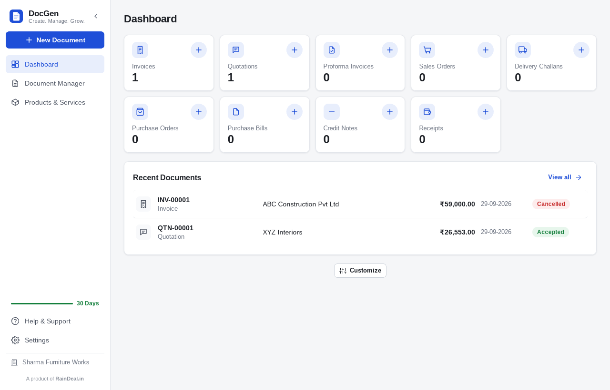
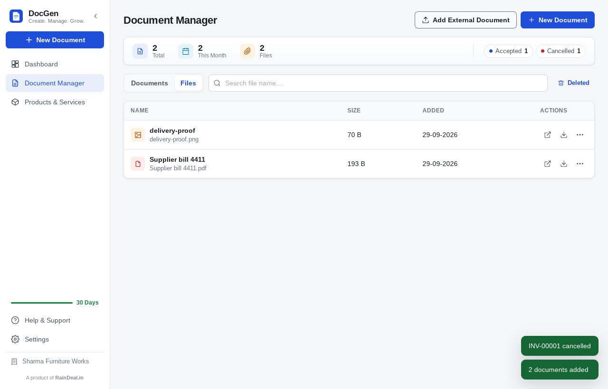
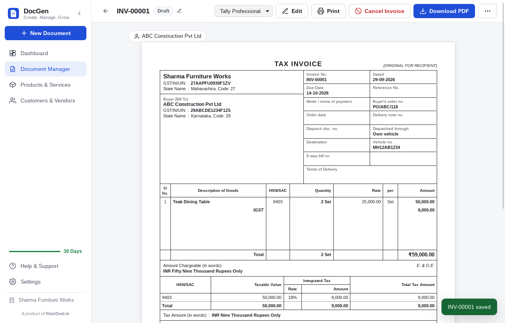
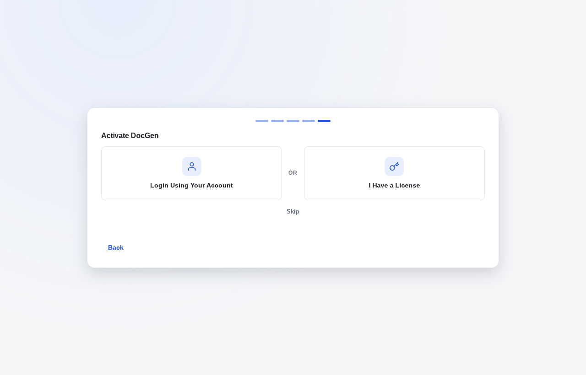
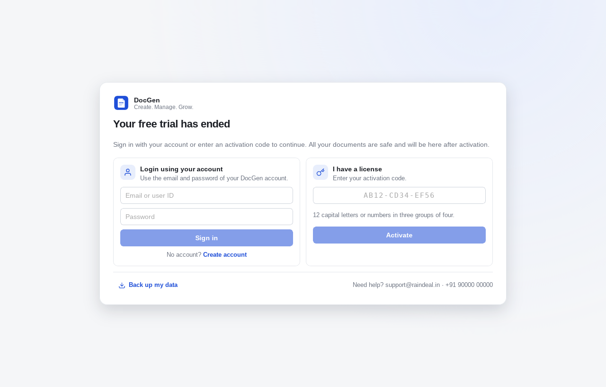
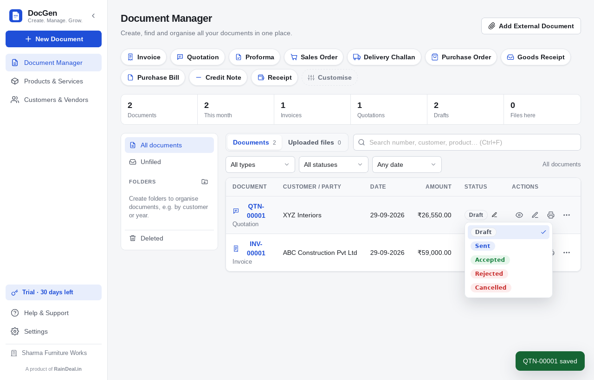

# DocGen — Create. Manage. Grow.

DocGen is a small, fast desktop app for creating and managing business documents:
GST invoices, quotations, estimates, orders, challans, credit/debit notes, receipts,
work orders and job completion reports. It also keeps your other business files
(supplier bills, contracts, delivery proofs) in the same place.

Built with **Tauri 2 + React (JavaScript) + SQLite**. It works completely **offline**;
all business data stays in one local file. A product of [reynrel.in](https://reynrel.in).

| Dashboard | Document Manager | Tally Professional GST invoice |
|---|---|---|
|  |  |  |

| Activation | After 30 days | Status quick edit |
|---|---|---|
|  |  |  |

---

## Features

- **Dashboard**: document-type cards in two rows with the number of documents and a round **+**
  to create one; the last 10 documents below; **Customize** chooses which cards appear (up to 12).
- **Document Manager**: one compact summary card (total, this month, files, count per status),
  Documents / Files, search with a document-type filter, **+ New Document**, **Download** (sales data
  for a month / financial year / custom dates as a CSV that opens in Excel: invoices, bills of supply,
  credit and debit notes with party GSTIN and state, place of supply, taxable value, CGST, SGST, IGST,
  total and status), and **Add External Document** (PDF, images, Word/Excel/CSV, text, up to 25 MB,
  stored inside the database so backups include them). Deleted items can be restored.
- **Bank details and UPI QR**: invoices print your bank details and a UPI QR code for the exact
  amount (Settings → Company → bank details and UPI ID). Each quotation has its own **Show bank
  details** switch (off by default).
- **Saved customers**: typing a name offers saved customers/vendors; one click fills the details.
  (There is no separate customer management screen.)
- **Round Off** as a Yes/No choice directly above Grand Total.
- **Number of copies** (Settings → Documents): single, double, triple or 4 copies when printing or
  saving a PDF, labelled Original for Recipient / Duplicate for Transporter / Triplicate for Supplier.
- Small **?** help beside fields that need explaining (place of supply, HSN/SAC, reverse charge,
  e-way bill, round off …).
- **Status in the list**: click the pencil next to a status, pick a new one — saved immediately.
  Each type has its own statuses (e.g. Quotation: Draft → Sent → Accepted/Rejected).
- **18 document types** with type-specific fields, required fields, numbering, statuses,
  conversions and print layout (see [Document types](#document-types)).
- **Four print templates** — *Tally Professional* (full GST invoice, Rule 46), *Tally Standard*,
  *Modern*, *Simple*. Default per app, per document type, or per single document; switching
  never changes data.
- **Indian GST**: GSTIN validation, state from GSTIN, state codes on print, place of supply →
  CGST+SGST or IGST, HSN/SAC summary, reverse charge, amount and tax amount in words,
  declaration, jurisdiction. VAT or no-tax also supported.
- **Preview actions**: Print, **Download PDF** (direct, no print dialog on Windows/Linux),
  **Cancel Invoice** (asks for a reason, keeps the document with a CANCELLED mark and history —
  financial documents are never silently deleted), template switcher, history.
- **Searchable selects** for states, units and currencies: first 10 options
  (recently used first), type to search long lists.
- **Units**: 50+ product and service units (Nos, Kg, Box, Sq.ft, Hour, Visit, Lump sum …) plus your own,
  in a searchable list (service units first for services).
- **GST** chosen from a searchable list (0, 0.25, 3, 5, 12, 18, 28, 40 % plus your own rates);
  on products, HSN/SAC and GST share one row.
- **Activation**: two choices — *Login Using Your Account* OR *I Have a License* — plus *Skip*.
  During the first 30 days a thin green line in the sidebar shows the days remaining. After that,
  a popup asks for an account login or a license (`AB12-CD34-EF56`). Licenses are Ed25519-signed
  and bound to the computer.
- **Help & Support**: YouTube tutorials (from the server), built-in guides, FAQ, contact buttons.
- **Remote configuration** (optional server): announcements/ads (sandboxed), help videos,
  check interval — checked monthly by default, resumed automatically after being offline.
- **Keyboard data entry** in every form (documents, products, settings, setup, sign-in):
  type → **Enter** → next field; **↑/↓** previous/next field; in dropdowns Enter/Space opens,
  typing searches, Enter chooses and moves on; in item rows the last field leads to *Add Item*
  (Enter adds a row) and Enter on an empty item name leaves the list; Enter twice leaves a
  multi-line box; Enter on the last field saves (product dialog, settings). Arrow keys keep their
  normal meaning in dates, native dropdowns and inside multi-line text. Implemented once in
  `src/utils/keynav.js` for every `[data-keynav]` area.
- Light theme by default, optional dark theme; collapsible sidebar; keyboard shortcuts
  (`Ctrl+N` new, `Ctrl+S` save, `Ctrl+P` print, `Ctrl+F` search, `Esc` close).
- Exact decimal maths, amount in words (Indian & international), backup/restore, sample data.

## Project structure

```
document-generator/
├── src/                          React UI (JavaScript + JSDoc)
│   ├── App.jsx                   route table, license gate, theme
│   ├── layouts/AppLayout.jsx     collapsible sidebar, brand, 30-day line, "A product of reynrel.in"
│   ├── components/               SearchSelect, StatusEditor, Modal, Form, Menu, Icon …
│   ├── config/
│   │   ├── documentTypes.js      ◀ document type registry (fields, statuses, templates)
│   │   ├── states.js             GST state codes, GSTIN validation
│   │   ├── units.js              product & service units
│   │   ├── defaults.js           default settings, per-type setting resolution
│   │   └── appConfig.js          ◀ branding: name, tagline, icon, support contacts
│   ├── features/
│   │   ├── dashboard/            Dashboard (type cards, recent documents)
│   │   ├── manager/              Document Manager (list, files, summary)
│   │   ├── documents/            editor, viewer (print/PDF/cancel/history), actions
│   │   ├── products/             products & services
│   │   ├── license/              activation choices, 30-day line, activation popup, settings
│   │   ├── help/                 Help & Support
│   │   ├── ads/                  ad selection (adService.js) + sandboxed popup
│   │   ├── settings/ setup/      settings sections, first-run wizard
│   ├── renderer/                 A4 renderer: TallyProDocument.jsx + shared blocks, document.css
│   ├── services/                 Tauri command wrappers (documents, files, license, remote config …)
│   └── utils/                    decimal, GST calc, words, dates, HSN summary, QR
├── src-tauri/                    Rust backend
│   ├── remote-config.json        ◀ server URL, portal URL, license public key
│   ├── migrations/               001 … 004 (004 = folders, files, history, license state)
│   └── src/  commands.rs (documents, catalog, settings), files.rs (folders & external files),
│             license.rs (trial, activation, tokens), remote.rs (server calls, config validation),
│             pdf.rs (direct PDF), numbering.rs, db.rs
├── tests/                        JS unit tests
└── e2e/run.mjs                   end-to-end test of the real app against a local server
```

The license/config **server** and the **client portal / admin panel** live in
[`../server`](../server) ([`backend`](../server/backend) + [`frontend`](../server/frontend)); one port serves them all.

## Prerequisites

| Tool | Version |
|------|---------|
| Node.js | 20+ |
| Rust | stable (`rustup`) |
| Tauri system dependencies | <https://v2.tauri.app/start/prerequisites/> |

Windows needs the Microsoft C++ Build Tools ("Desktop development with C++") to compile
locally. **You don't need them to get an installer**: GitHub Actions builds it for you —
see [Windows installer](#windows-installer).

## Development

```bash
cd document-generator
npm install
npm run app:dev        # Vite on :1420 + desktop window with hot reload
```

To develop against a local server (debug builds only):

```bash
cd ../server && npm install && ADMIN_EMAIL=admin@example.com ADMIN_PASSWORD='change-me-now' npm run dev
# note the "License public key" printed at startup, then in another terminal:
DOCGEN_SERVER_URL=http://localhost:8787 DOCGEN_PORTAL_URL=http://localhost:8787 \
DOCGEN_LICENSE_PUBLIC_KEY=<key> npm run app:dev
```

**Windows troubleshooting** — `linker 'link.exe' not found`: install the C++ Build Tools
(`winget install Microsoft.VisualStudio.2022.BuildTools --override "--wait --passive --add Microsoft.VisualStudio.Workload.VCTools --includeRecommended"`),
reopen the terminal, `rustup default stable-msvc`. `Port 1420 is already in use`: stop the old
dev server (`Get-NetTCPConnection -LocalPort 1420 -State Listen | ForEach-Object { Stop-Process -Id $_.OwningProcess -Force }`).

## Configuration before building

`src-tauri/remote-config.json`:

```json
{
  "serverUrl": "https://api.docgen.reynrel.in",
  "portalUrl": "https://docgen.reynrel.in",
  "websiteUrl": "https://reynrel.in",
  "licensePublicKey": "<printed by the server at startup>",
  "requestTimeoutSecs": 10
}
```

- `serverUrl` empty → **fully offline build**: no network requests at all; the 30 days work,
  sign-in/activation are unavailable, and a built-in ad appears every 15 days.
- **Built-in ads** (bundled, no internet needed; `src/features/ads/adService.js` → `HOUSE_ADS`): shown every
  15 days when the app is offline, has never reached the server, or the server has no ad to show. They take
  turns: "Activate DocGen" (only without a license), reynrel.in's billing & inventory software, POS billing for
  cafés/restaurants/salons, and three reynrel.in services (websites, custom software & apps, Google/social ads).
  Buttons open reynrel.in (tagged `utm_source=docgen-desktop`). Admin → App settings → built-in ad off
  (`defaultAdEnabled: false`) switches them off once the app has the server configuration.
- Release builds only accept `https://` URLs. The `DOCGEN_*` environment overrides work only in debug builds.

Branding (`src/config/appConfig.js`): app name, tagline, icon (`public/brand-icon.png`; installer icons from `assets/app-icon.png` via `npx tauri icon`),
company link, support e-mail/phone/WhatsApp, YouTube channel.

## Data

SQLite is compiled in. On first start DocGen creates the database and runs all migrations.

| OS | Data file |
|----|-----------|
| Windows | `%APPDATA%\com.docgen.desktop\docgen.sqlite` |
| macOS | `~/Library/Application Support/com.docgen.desktop/docgen.sqlite` |
| Linux | `~/.local/share/com.docgen.desktop/docgen.sqlite` |

Migrations are in `src-tauri/migrations/` and listed in `src-tauri/src/db.rs`. Upgrades from
v1.0 are automatic (tested in `upgrade_from_version_1_keeps_documents_items_and_links`).
Money is stored as exact decimal text; each document keeps a snapshot of party, lines, taxes
and totals as printed. External files are stored as de-duplicated blobs (`file_blobs`).
Indexes cover list, search, folder and status queries (20,000 documents: manager opens in ~0.7 s).

## Document types

Defined in `src/config/documentTypes.js`. Each entry declares:

| Key | Meaning |
|-----|---------|
| `id`, `label`, `short`, `prefix`, `title` | identity, numbering prefix (`INV-00001`), printed title |
| `group`, `partyLabel`, `partyKind` | sales/purchase/stock/payment/service; "Bill To", "Vendor" … |
| `dateLabel`, `dueLabel`, `dueSetting` | date captions; default offset (due/validity/delivery days) |
| `statuses`, `statusLabels` | allowed statuses in workflow order, per-type wording |
| `required` | fields that must be filled (`party_name`, `items`, `meta.againstInvoice` …) |
| `optional` | "Additional details" fields (dispatch, e-way bill, order no., reverse charge …) |
| `financial` | issued copies must be cancelled, never deleted |
| `layout`, `conversions`, `defaults` | standard/receipt; allowed conversions; per-type settings |

Built in: Tax Invoice, Service Invoice, Quotation, Reverse Quotation (your price offer to a
supplier; converts into a Purchase Order), Estimate, Proforma Invoice, Sales Order, Delivery Challan,
Purchase Order, Goods Receipt Note, Purchase Invoice/Bill, Credit Note, Debit Note, Bill of Supply,
Payment Receipt (money received), Payment Voucher (money paid out; also the voucher for reverse-charge
payments, CGST Rule 52), Work Order, Job/Service Completion.

To add one, add an entry — numbering, editor fields, validation, filters, settings and printing
pick it up automatically. Unknown types from older data still open with safe defaults.

## Build

```bash
npm run app:build      # optimized build + installers for the current OS
```

### Windows and macOS installers

Without installing Visual Studio or Xcode: push to the repository and let **GitHub Actions** build
both (`.github/workflows/docgen-build.yml`, uses only shell commands). Download from the
*"DocGen latest build"* pre-release:

- **Windows**: `DocGen_<version>_x64-setup.exe` (or the `.msi`).
- **macOS**: `DocGen_<version>_universal.dmg` — one file for Apple Silicon and Intel Macs, macOS 10.15+.
  Open it and drag DocGen into Applications. Without an Apple Developer certificate the app is
  ad-hoc signed, so the first time macOS asks you to confirm: right-click DocGen → **Open** → **Open**
  (or System Settings → Privacy & Security → **Open Anyway**). To ship a signed and notarized app,
  add the `APPLE_*` repository secrets listed at the top of the workflow file.

Push a tag `docgen-v1.1.0` for a versioned release. Manual runs: Actions → *DocGen build* → *Run workflow*.

Locally on Windows: `npm install && npm run app:build` →
`src-tauri\target\release\bundle\nsis\DocGen_<version>_x64-setup.exe` and `…\msi\…msi`.
Locally on a Mac (Xcode command line tools + Rust): `rustup target add x86_64-apple-darwin aarch64-apple-darwin`
then `npx tauri build --target universal-apple-darwin --bundles app,dmg`.

On macOS the **Download PDF** button opens the print dialog; choose **Save as PDF** there.

## Tests

```bash
npm test               # JS unit tests (decimal/GST maths, words, ads, config schedule, GSTIN, codes, HSN summary)
npm run test:rust      # Rust tests (migrations incl. v1 upgrade, numbering, backup, licensing, config validation)
npm run lint

# End-to-end (Linux): real app + real local server
cargo install tauri-driver --locked && sudo apt install webkit2gtk-driver xvfb
(cd ../server && npm ci)
npx tauri build --debug --no-bundle
xvfb-run -a node e2e/run.mjs
```

The e2e run (158 checks, 17 phases) is described with its results in [`../TESTING.md`](../TESTING.md).

## Security notes

- The web layer has only `core:default` permissions; file dialogs, printing, PDF, backups and
  links are fixed-behaviour Rust commands.
- License tokens are verified offline with the server's Ed25519 public key and bound to a
  device ID (hash of the machine ID). A trial reset or clock rollback does not extend the trial.
- Business data (documents, customers, products, files) is never sent to the server.
- Remote configuration is validated in Rust (HTTPS URLs, lengths, ranges). Ad HTML is shown in an
  `<iframe sandbox>` with no scripts and an opaque origin; it is never injected into the app.
- CSP: `script-src 'self'`; images may be `https:`; links opened externally must be `https:`, `mailto:` or `tel:`.
